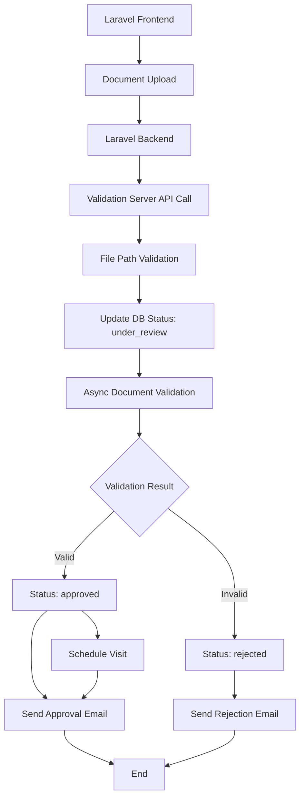

# BeanTrack Vendor Validation Server

## Table of Contents
1. [Overview](#overview)
2. [Architecture](#architecture)
3. [User Story](#user-story)
4. [Workflow](#workflow)
5. [Component Documentation](#component-documentation)
6. [API Reference](#api-reference)
7. [Configuration](#configuration)
8. [Database Schema](#database-schema)
9. [Email Notification System](#email-notification-system)
10. [Visit Scheduling](#visit-scheduling)
11. [Error Handling](#error-handling)
12. [Testing and Development](#testing-and-development)

## Overview

The BeanTrack Vendor Validation Server is a Spring Boot microservice that handles vendor application document validation for the BeanTrack supply chain management system. It receives vendor applications from a Laravel backend, validates uploaded documents (bank statements and trading licenses), and sends email notifications with visit scheduling for approved applicants.

### Key Features
- **Asynchronous Document Validation**: PDF document analysis with OCR-like text extraction
- **Financial Assessment**: Bank statement analysis for financial capacity validation
- **License Verification**: Trading license validation with expiry date checking
- **Email Notifications**: Professional HTML email templates for approval/rejection
- **Visit Scheduling**: Automatic scheduling of business visits for approved vendors
- **Status Tracking**: Real-time application status updates and polling endpoints

## Architecture

### Component Structure
```
com.groupe.beantrackserver/
├── controller/
│   └── VendorController.java          # REST API endpoints
├── service/
│   ├── VendorValidationService.java   # Core validation logic
│   ├── EmailService.java              # Email notification handling
│   └── VisitSchedulingService.java    # Visit date scheduling
├── models/
│   ├── VendorApplications.java        # Entity mapping to database
│   └── VendorValidationResponse.java  # API response structure
└── repository/
    └── VendorApplicationsRepository.java # Data access layer
```

### Technology Stack
- **Framework**: Spring Boot 3.5.3
- **Database**: MySQL 8.0 with JPA/Hibernate
- **Document Processing**: Apache PDFBox 2.0.27
- **Email**: Spring Boot Mail with Thymeleaf templates
- **Build Tool**: Maven

## User Story

### Primary User Journey
**As a** vendor applicant  
**I want to** submit my business documents for validation  
**So that** I can become an approved vendor in the BeanTrack system  

### Detailed User Flow
1. **Application Submission**: Vendor submits application through Laravel frontend
2. **Document Upload**: Laravel backend uploads documents and calls validation server
3. **Validation Processing**: Server validates documents asynchronously 
4. **Status Updates**: Application status transitions through: `pending` → `under_review` → `approved/rejected`
5. **Email Notification**: Automated emails sent based on validation outcome
6. **Visit Scheduling**: For approved vendors, visit date is automatically scheduled

## Workflow

### High-Level Process Flow


### Detailed Validation Workflow
1. **Initial Validation**
   - Check file existence
   - Validate naming conventions
   - Retrieve existing application record

2. **Document Processing**
   - Extract text from PDFs using PDFBox
   - Parse bank statement for financial data
   - Validate trading license information

3. **Business Rules Validation**
   - Bank statement: Verify account holder name matches applicant
   - Financial capacity: Check minimum balance and credits
   - Trading license: Validate registration number format and expiry date

4. **Status Update and Notification**
   - Update database with validation results
   - Trigger appropriate email notification
   - Schedule visit for approved applications

## Component Documentation

### VendorController.java

The REST API controller that handles HTTP requests for vendor applications.

#### Key Methods

**`applyVendor()` - Main Application Endpoint**
```java
@PostMapping("/api/vendors/apply")
public ResponseEntity<VendorValidationResponse> applyVendor(
    @RequestParam("applicantId") String applicantId,
    @RequestParam("name") String name,
    @RequestParam("email") String email,
    @RequestParam("bankStatement") String bankStatementPath,
    @RequestParam("tradingLicense") String tradingLicensePath,
    @RequestParam("businessName") String businessName
)
```

**Purpose**: Receives vendor application data from Laravel backend  
**Validation**: 
- Validates file paths exist and match naming conventions
- Ensures required parameters are provided
- Calls validation service asynchronously

**Expected File Naming Pattern**: `{applicantId}_{document-type}.pdf`  
Example: `VA00001_bank-statement.pdf`, `VA00001_trading-license.pdf`

**`getApplicationStatus()` - Status Polling Endpoint**
```java
@GetMapping("/api/vendors/status/{applicationId}")
public ResponseEntity<?> getApplicationStatus(@PathVariable String applicationId)
```

**Purpose**: Allows frontend to poll application status  
**Returns**: JSON with application status, validation message, and timestamps

### VendorValidationService.java

Core service containing the business logic for document validation.

#### Key Methods

**`submitApplication()` - Application Processing Entry Point**
```java
public VendorValidationResponse submitApplication(
    String applicantId, String name, String email, String phoneNumber,
    String bankPath, String licensePath, String businessName
) throws IOException
```

**Process**:
1. Validates file existence
2. Retrieves existing application record by ID
3. Updates status to `under_review`
4. Starts asynchronous validation with delay to avoid race conditions

**`validateApplicationAsync()` - Core Validation Logic**
```java
@Async
@Transactional
public void validateApplicationAsync(String applicationId)
```

**Process**:
1. **Bank Statement Validation**:
   ```java
   // Extract text and validate account holder name
   boolean bankValid = validateBankFile(bankStatementPath, applicantName) &&
       validateFinancialStatusFromBankStatement(bankStatementPath, 5000000.0, 10000000.0);
   ```

2. **Trading License Validation**:
   ```java
   // Validate registration number and expiry date
   boolean licenseValid = validateLicenseFile(licensePath, businessName);
   ```

3. **Status Update and Email Notification**:
   ```java
   if (bankValid && licenseValid) {
       application.setStatus(ApplicationStatus.approved);
       emailService.sendApprovalEmailWithVisit(application);
   } else {
       application.setStatus(ApplicationStatus.rejected);
       emailService.sendRejectionEmail(application);
   }
   ```

**Bank Statement Validation Rules**:
- Account holder name must match applicant name
- Minimum available balance: UGX 5,000,000
- Minimum total credits: UGX 10,000,000

**Trading License Validation Rules**:
- Must be PDF format
- Registration number format: `CM` followed by 6+ digits
- License must not be expired
- Business name must match application

### EmailService.java

Handles email notifications with professional HTML templates.

#### Key Methods

**`sendApprovalEmailWithVisit()` - Approval Notification**
```java
@Async
public void sendApprovalEmailWithVisit(VendorApplications application)
```

**Process**:
1. Schedule visit date using `VisitSchedulingService`
2. Update application with scheduled visit date
3. Send HTML email with visit details
4. Uses Thymeleaf template: `email/approval.html`

**Email Content Includes**:
- Congratulations message
- Visit date, time, and location
- Required documents to bring
- Contact information

**`sendRejectionEmail()` - Rejection Notification**
```java
@Async
public void sendRejectionEmail(VendorApplications application)
```

**Process**:
1. Send professional rejection email
2. Include specific validation failure reasons
3. Provide guidance for reapplication
4. Uses Thymeleaf template: `email/rejection.html`

### VisitSchedulingService.java

Handles automatic visit scheduling for approved vendors.

#### Scheduling Logic
```java
public LocalDateTime scheduleVisit(String applicationId) {
    LocalDateTime proposedDate = LocalDateTime.now().plusDays(3);
    
    // Ensure business day (Monday-Friday)
    while (isWeekend(proposedDate)) {
        proposedDate = proposedDate.plusDays(1);
    }
    
    // Assign time slot (currently defaults to 9:00 AM)
    return proposedDate.toLocalDate().atTime(timeSlots[0]);
}
```

**Available Time Slots**:
- 9:00 AM
- 11:00 AM  
- 2:00 PM
- 4:00 PM

**Business Rules**:
- Visits scheduled 3+ days in advance
- Business days only (Monday-Friday)
- Currently uses simple first-available-slot algorithm

### VendorApplications.java

JPA entity mapping to the `vendor_applications` database table.

#### Key Fields
```java
@Entity
@Table(name = "vendor_applications")
public class VendorApplications {
    @Id
    private String id;                    // Application ID (e.g., VA00001)
    
    private String applicantName;         // Vendor's name
    private String businessName;          // Business name
    private String email;                 // Contact email
    private String phoneNumber;           // Contact phone
    
    private String bankStatementPath;     // File path to bank statement
    private String tradingLicensePath;    // File path to trading license
    
    @Enumerated(EnumType.STRING)
    private ApplicationStatus status;     // pending, under_review, approved, rejected
    
    private LocalDate visitScheduled;     // Scheduled visit date
    private String validationMessage;     // Validation result details
    private LocalDateTime validatedAt;    // Validation completion timestamp
}
```

#### Status Enum
```java
public enum ApplicationStatus {
    pending,      // Initial state when application is created
    under_review, // Documents are being validated
    approved,     // Validation passed, vendor approved
    rejected      // Validation failed, vendor rejected
}
```

## API Reference

### Base URL
```
http://localhost:8080/api/vendors
```

### Endpoints

#### Submit Vendor Application
```http
POST /api/vendors/apply
Content-Type: application/x-www-form-urlencoded

applicantId=VA00001
name=John Doe
email=john@example.com
phoneNumber=+256700123456
bankStatement=/path/to/VA00001_bank-statement.pdf
tradingLicense=/path/to/VA00001_trading-license.pdf
businessName=Doe Coffee Enterprise
```

**Response (Success)**:
```json
{
    "status": "under_review",
    "message": "Application submitted successfully. You will be notified once validation is complete.",
    "bankStatementPath": "/path/to/VA00001_bank-statement.pdf",
    "tradingLicensePath": "/path/to/VA00001_trading-license.pdf"
}
```

**Response (Error)**:
```json
{
    "status": "error",
    "message": "File not found: /path/to/missing-file.pdf",
    "bankStatementPath": "",
    "tradingLicensePath": ""
}
```

#### Get Application Status
```http
GET /api/vendors/status/{applicationId}
```

**Response**:
```json
{
    "applicationId": "VA00001",
    "status": "approved",
    "message": "Vendor application approved.",
    "submittedAt": "2025-07-01T10:30:00",
    "validatedAt": "2025-07-01T10:32:00"
}
```

## Configuration

### application.properties
```properties
# Database Configuration
spring.datasource.url=jdbc:mysql://127.0.0.1:4000/laravel
spring.datasource.username=root
spring.datasource.password=

# JPA Configuration
spring.jpa.hibernate.ddl-auto=update
spring.jpa.show-sql=true

# Email Configuration
spring.mail.host=smtp.gmail.com
spring.mail.port=587
spring.mail.username=your-email@gmail.com
spring.mail.password=your-app-password
spring.mail.properties.mail.smtp.auth=true
spring.mail.properties.mail.smtp.starttls.enable=true

# Custom Vendor Application Settings
vendor.email.from=noreply@beantrack.com
vendor.email.from-name=BeanTrack Vendor Registration
vendor.visit.location=BeanTrack Office, Kampala
vendor.visit.address=Plot 123, Coffee Avenue, Kampala, Uganda
vendor.visit.contact=+256 700 123456
```

### Gmail Setup for Email Service
1. **Enable 2-Factor Authentication** on your Google account
2. **Generate App Password**:
   - Go to Google Account → Security → 2-Step Verification → App passwords
   - Select "Mail" and generate password
   - Use the 16-character password in configuration

## Database Schema

### vendor_applications Table
```sql
CREATE TABLE vendor_applications (
    id VARCHAR(7) PRIMARY KEY,
    applicant_name VARCHAR(255) NOT NULL,
    business_name VARCHAR(255) NOT NULL,
    phone_number VARCHAR(255) NOT NULL,
    email VARCHAR(255) NOT NULL,
    bank_statement_path VARCHAR(500),
    trading_license_path VARCHAR(500),
    status ENUM('pending', 'under_review', 'approved', 'rejected') DEFAULT 'pending',
    visit_scheduled DATE,
    validation_message TEXT,
    validated_at TIMESTAMP NULL,
    created_at TIMESTAMP DEFAULT CURRENT_TIMESTAMP,
    updated_at TIMESTAMP DEFAULT CURRENT_TIMESTAMP ON UPDATE CURRENT_TIMESTAMP
);
```

### Relationships
- **Users Table**: Foreign key relationship via `created_user_id`
- **Laravel Integration**: Shared database with Laravel backend

## Email Notification System

### Template Structure
- **Location**: `src/main/resources/templates/email/`
- **Engine**: Thymeleaf template processing
- **Format**: HTML with embedded CSS

### Approval Email Template (approval.html)
**Variables**:
- `${applicantName}` - Vendor's name
- `${businessName}` - Business name  
- `${visitDate}` - Formatted visit date
- `${visitTime}` - Formatted visit time
- `${visitLocation}` - Visit location name
- `${visitAddress}` - Full visit address
- `${applicationId}` - Application reference

**Content Sections**:
1. Congratulations header
2. Approval confirmation
3. Visit details with date/time/location
4. Required documents list
5. Next steps checklist
6. Contact information

### Rejection Email Template (rejection.html)
**Variables**:
- `${applicantName}` - Vendor's name
- `${businessName}` - Business name
- `${rejectionReasons}` - Specific validation failures
- `${applicationId}` - Application reference
- `${supportContact}` - Support contact info

**Content Sections**:
1. Professional rejection message
2. Detailed rejection reasons
3. Reapplication guidance
4. Support contact information
5. Common requirements checklist

## Visit Scheduling

### Current Implementation
- **Advance Notice**: 3 business days minimum
- **Business Hours**: Monday-Friday only
- **Time Slots**: 9:00 AM, 11:00 AM, 2:00 PM, 4:00 PM
- **Algorithm**: Simple first-available slot assignment

### Future Enhancements
- Conflict checking with existing appointments
- Multiple time slots per day
- Holiday calendar integration
- Manual rescheduling capabilities
- Calendar integration (iCal/Outlook)

## Error Handling

### Validation Errors
- **File Not Found**: When uploaded files are missing
- **Naming Convention**: When files don't match expected patterns
- **Document Format**: When PDFs are corrupted or unreadable
- **Business Rule Violations**: When validation criteria aren't met

### Email Delivery Errors
- **Authentication Failures**: Gmail credentials or app password issues
- **Template Errors**: Thymeleaf template processing failures
- **SMTP Connectivity**: Network or server configuration issues

### Database Errors
- **Connection Issues**: MySQL connectivity problems
- **Transaction Failures**: Concurrent modification conflicts
- **Data Integrity**: Foreign key constraint violations

### Logging and Monitoring
```java
// Example error logging
System.err.println("Error during async validation for application: " + applicationId);
e.printStackTrace();

// Success logging
System.out.println("Validation completed for application: " + applicationId + 
    " - Status: " + application.getStatus());
```

## Testing and Development

### Running the Application
```bash
# Using Maven wrapper
./mvnw spring-boot:run

# Using Maven (if installed)
mvn spring-boot:run
```

### Testing Endpoints
```bash
# Test application submission
curl -X POST http://localhost:8080/api/vendors/apply \
  -d "applicantId=TEST001" \
  -d "name=Test User" \
  -d "email=test@example.com" \
  -d "phoneNumber=+256700000000" \
  -d "bankStatement=/path/to/TEST001_bank-statement.pdf" \
  -d "tradingLicense=/path/to/TEST001_trading-license.pdf" \
  -d "businessName=Test Business"

# Check application status  
curl http://localhost:8080/api/vendors/status/TEST001
```

### Development Guidelines
1. **File Uploads**: Ensure test files exist in specified paths
2. **Database**: Verify MySQL connection and table structure
3. **Email Testing**: Use valid Gmail credentials with app password
4. **Async Processing**: Monitor logs for async validation completion
5. **Error Scenarios**: Test with invalid files and missing data

### Sample Test Files
Create test PDF files with appropriate content:
- **Bank Statement**: Should contain applicant name and financial data
- **Trading License**: Should contain CM123456 registration number and valid expiry date

## Integration with Laravel Backend

### Expected Laravel Workflow
1. **File Upload**: Laravel handles multipart file uploads
2. **File Storage**: Files saved to shared filesystem or cloud storage
3. **API Call**: Laravel calls Java validation server with file paths
4. **Status Polling**: Laravel can poll for status updates
5. **User Notification**: Laravel can complement with its own notifications

### Shared Components
- **Database**: Both systems share the same MySQL database
- **File System**: Shared access to uploaded documents
- **Application IDs**: Consistent ID format across systems

---

## Conclusion

The BeanTrack Vendor Validation Server provides a robust, scalable solution for vendor document validation with automated email notifications and visit scheduling. Its asynchronous processing ensures responsive user experience while comprehensive validation rules maintain quality standards for vendor onboarding.

The modular architecture allows for easy extension and customization, while the comprehensive error handling and logging ensure reliable operation in production environments.
